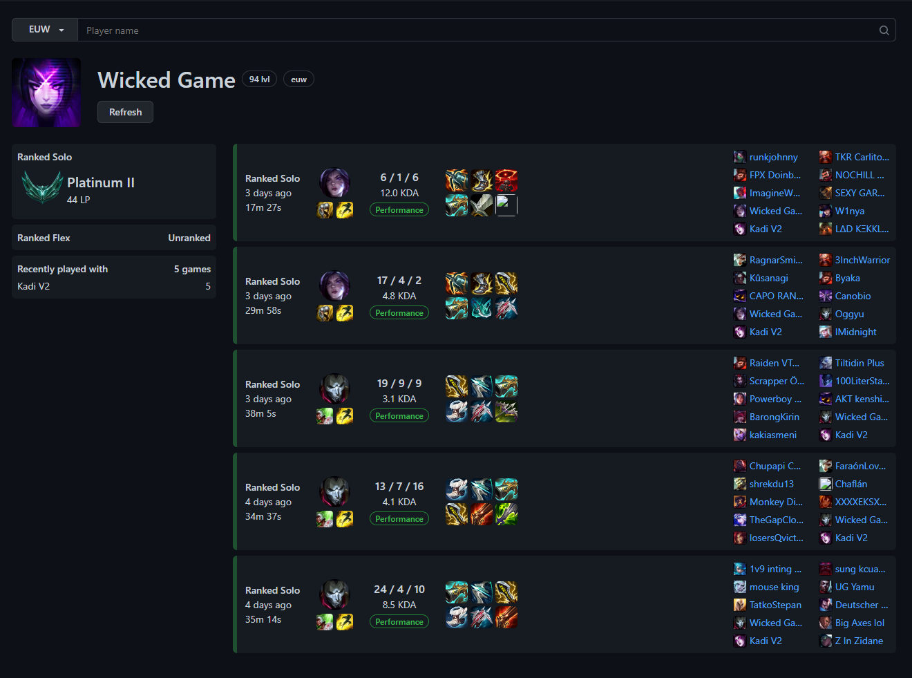

<br />
<p align="center">

  <h3 align="center">League tracker</h3>

  <p align="center">
    Get insight about your ranked performance
    <br />
    <br />
    <a href="https://github.com/arnoldkokot/issues">Report bug</a>
    ·
    <a href="https://github.com/arnoldkokot/issues">Request Feature</a>
  </p>
</p>

<!-- TABLE OF CONTENTS -->
<details>
  <summary>Table of Contents</summary>
  <ol>
    <li>
      <a href="#about-the-project">About The Project</a>
      <ul>
        <li><a href="#features">Features</a></li>
        <li><a href="#built-with">Built With</a></li>
      </ul>
    </li>
    <li>
      <a href="#getting-started">Getting Started</a>
      <ul>
        <li><a href="#prerequisites">Prerequisites</a></li>
        <li><a href="#installation">Installation</a></li>
      </ul>
    </li>
    <li>
      <a href="#usage">Usage</a>
      <ul>
        <li><a href="#endpoints">Endpoints</a></li>
      </ul>
    </li>
    <li><a href="#license">License</a></li>
    <li><a href="#contact">Contact</a></li>
    <li><a href="#acknowledgements">Acknowledgements</a></li>
  </ol>
</details>

## About The Project



League tracker provides insight to League of Legends players about thier game performance, match
history, and ranked ladder via Riot API.

### Built With

Major tools used are listed below, to see the full list go to acknowledgements.

- Backend
  - [Node](https://nodejs.org/en/)
  - [MongoDB](https://www.mongodb.com/)
- Frontend
  - [React](https://reactjs.org/)
  - [Redux toolkit](https://redux-toolkit.js.org/)

## Getting Started

To get a local copy up and running follow steps below.

### Prerequisites

Node and npm are required to install and run the project. Riot API key is essential to display
valuable content. MongoDB database is optional but recommended as it reduces Riot API requests by
storing them locally.

### Installation

1. Clone the repo
   ```sh
   git clone https://github.com/arnoldkokot/tracker.git
   ```
2. Install backend NPM packages
   ```sh
   cd backend
   npm install
   ```
3. Create .env file
   ```sh
   touch .env
   nano .env
   ```
4. Paste your API key and mongoDB connection string
   ```sh
   API_KEY=*riot api key*
   PORT=5000
   DB_CONNECTION_STRING=*mongoDB connection string*
   ```
5. Run backend
   ```sh
   npm run dev
   ```
6. Install frontend NPM packages
   ```sh
   cd frontend
   npm install
   ```
7. Run project
   ```sh
   npm start
   ```

## Usage

### Endpoints

All API request start with `/api/` and are guaranteed to return JSON data.

- `/api/player/:playerName`
  Responds with combined stats about player, costs 3-4 requests as name gets cashed for 3h

- `/api/matchlist/:puuid?page=:number`
  Responds with a list of 5 game ids for a given puuid (start index is page number), costs 1 riot request

- `/api/match/:id`
  Responds with info and metadata about given match id, costs 0-1 riot requests, depends on whether match is already in the database.

- `/api/list/:playerName`
  Responds with data set combined from all previous requests (with page in matchlist set to 1) costs 2 - 7 riot request

## License

Distributed under the MIT License. See `LICENSE` for more information.

## Contact

Arnold Kokot - [@deithyy](https://twitter.com/deithyy) - ogkokot@gmail.com

## Acknowledgements

- [Express](https://expressjs.com/)
- [MongoDB](https://www.mongodb.com/)
- [Create react app](https://create-react-app.dev/)
- [React](https://reactjs.org/)
- [Redux toolkit](https://redux-toolkit.js.org/)
